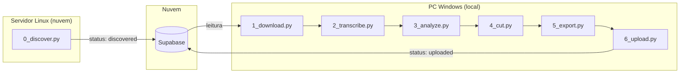

# Fluxo Funcional do Sistema - Shorts Automated

Este documento descreve como o sistema opera hoje, do momento em que um vídeo é encontrado no YouTube até a geração do Short final.

## 🧠 O Coração: Supabase (State Machine)

O sistema não depende de arquivos locais para saber o que fazer. Ele usa o **Supabase** como um cérebro central.

- Cada vídeo tem um `stage` (estágio).
- Cada script lê vídeos em um estágio e os "promove" para o próximo.

---

## 🚀 Ciclo de Vida do Conteúdo

### 1. Descoberta (`0_discover.py`)

- **Onde roda:** Servidor Linux (Discovery Layer).
- **O que faz:** Varre canais configurados (ex: PrimoCast, Flow).
- **Lógica:** Filtra vídeos dos últimos 90 dias com maior ROI (visualizações vs. tempo).
- **Resultado:** Registra o vídeo no Supabase com `stage = 'discovered'`.

### 2. Download (`1_download.py`)

- **Onde roda:** Local Windows (Processing Layer).
- **O que faz:** Busca no Supabase tudo que está em `discovered`.
- **Lógica:** Usa `yt-dlp` para baixar o MP4 na melhor qualidade.
- **Resultado:** Salva em `data/raw/` e atualiza para `stage = 'downloaded'`.

### 3. Transcrição (`2_transcribe.py`)

- **Onde roda:** Local Windows (GPU/CPU).
- **O que faz:** Pega vídeos `downloaded`.
- **Lógica:** Usa `Whisper` (OpenAI) para gerar um JSON com cada palavra e seu timestamp exato.
- **Resultado:** Salva em `data/transcripts/` e atualiza para `stage = 'transcribed'`.

### 4. Análise AI (`3_analyze.py`)

- **Onde roda:** Local Windows (API AI).
- **O que faz:** Pega a transcrição de vídeos `transcribed`.
- **Lógica:** Envia o texto para o GPT-4o. A IA identifica os momentos mais virais, cria títulos e define o tempo de início/fim de cada corte.
- **Resultado:** Cria registros na tabela `cuts` (cada corte é um item novo) e atualiza o vídeo para `stage = 'analyzed'`.

### 5. Edição e Corte (`4_cut.py`)

- **Onde roda:** Local Windows.
- **O que faz:** Busca cortes `pending` na tabela de cortes.
- **Lógica:** Usa `FFmpeg` para extrair os trechos exatos do vídeo original sem perda de qualidade.
- **Resultado:** Gera arquivos de vídeo menores e atualiza o corte para `status = 'processed'`.

### 6. Exportação e Legendas (`5_export.py`)

- **Onde roda:** Local Windows.
- **O que faz:** Finaliza o vídeo para publicação.
- **Lógica:** Aplica legendas dinâmicas, formatação vertical (9:16) e ajustes visuais.
- **Resultado:** Gera o arquivo final em `data/output/shorts/` e atualiza para `status = 'exported'`.

### 7. Upload Automático (`6_upload.py`)

- **Onde roda:** Local Windows.
- **O que faz:** Envia os vídeos prontos para o YouTube.
- **Lógica:**
  - Autentica via **OAuth2** (YouTube API v3).
  - Gera **Títulos e Descrições** otimizados usando a análise da IA.
  - Faz o upload do arquivo MP4.
- **Resultado:** O vídeo entra no canal como `privado` (para revisão) e o status no Supabase vira `uploaded`.

---

## 🛠️ Orquestração: Master Pipeline

O script `master_pipeline.py` é o "mestre de obras". Ele roda em um loop contínuo:

1. Chama o script de download.
2. Chama o de transcrição.
3. Chama o de análise... e assim por diante.

Se um script falhar ou não tiver nada para fazer, o mestre pula para o próximo, garantindo que o sistema nunca pare.

---

## 🔗 Modelo Híbrido (Server + Local)

